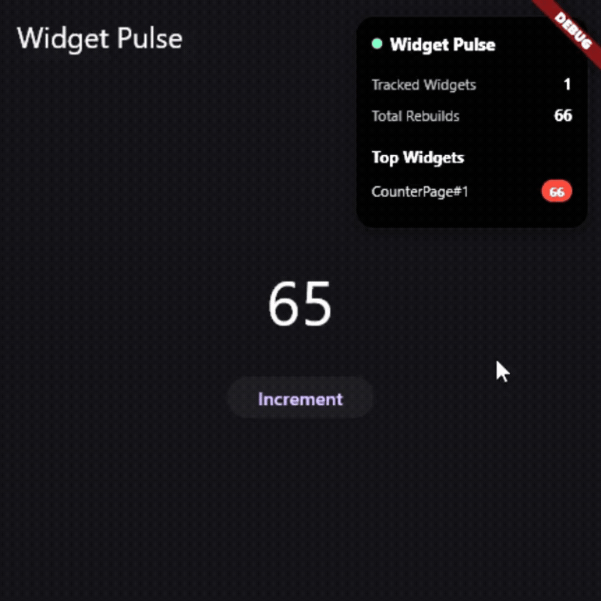
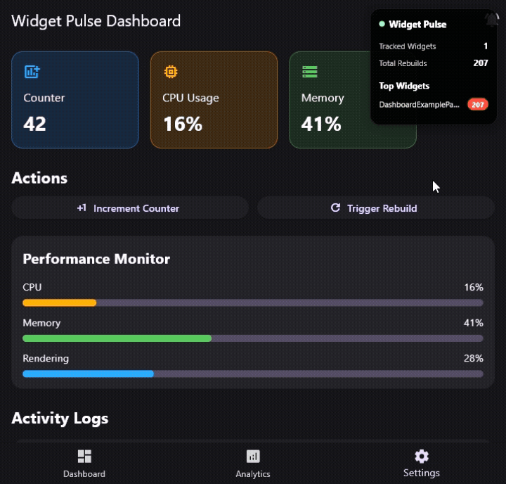

# Widget Pulse

Visualize Flutter widget rebuilds in real time.

O **Widget Pulse** é uma biblioteca open-source de developer tooling para Flutter focada em **runtime visual instrumentation** e profiling visual de rebuilds.

A proposta da biblioteca é ajudar desenvolvedores Flutter a identificar:

- rebuilds excessivos
- gargalos de renderização
- widgets com alto custo de reconstrução
- problemas de performance durante desenvolvimento

Tudo isso através de overlays visuais, métricas em tempo real e ferramentas leves de observabilidade visual.

---

# ✨ Features

## ✅ Disponível no MVP

- ✅ Rastreamento de rebuilds em tempo real
- ✅ Contador de rebuilds por widget
- ✅ Overlay visual de debug
- ✅ Arquitetura leve e extensível
- ✅ Integração plug-and-play
- ✅ Baixo impacto em performance
- ✅ Developer Experience focada em simplicidade

---

# 📸 Preview

## Overlay de Rebuilds

<!-- Adicionar GIF aqui -->
<p align="center">
 
</p>

---

## exemplo avançado de rebuild

<!-- Adicionar GIF aqui -->
<p align="center">
  
</p>

---

---

# 🚀 Instalação

Adicione no seu `pubspec.yaml`:

```yaml
dependencies:
  widget_pulse: ^0.1.0-alpha.1
```

Depois execute:

```bash
flutter pub get
```

---

# ⚡ Quick Start

Envolva sua aplicação com `WidgetPulse`.

```dart
import 'package:flutter/material.dart';
import 'package:widget_pulse/widget_pulse.dart';

void main() {
  runApp(
    WidgetPulse(
      child: MyApp(),
    ),
  );
}
```

---

# 🧩 Uso Básico

## Rastreando um Widget

```dart
TrackedWidget(
  name: 'CounterWidget',
  child: CounterWidget(),
)
```

---

# 📚 Exemplo Completo

```dart
import 'package:flutter/material.dart';
import 'package:widget_pulse/widget_pulse.dart';

void main() {
  runApp(
    WidgetPulse(
      child: MyApp(),
    ),
  );
}

class MyApp extends StatefulWidget {
  const MyApp({super.key});

  @override
  State<MyApp> createState() => _MyAppState();
}

class _MyAppState extends State<MyApp> {
  int counter = 0;

  @override
  Widget build(BuildContext context) {
    return MaterialApp(
      home: Scaffold(
        appBar: AppBar(
          title: const Text('Widget Pulse Example'),
        ),
        body: Center(
          child: TrackedWidget(
            name: 'CounterText',
            child: Text(
              '$counter',
              style: const TextStyle(fontSize: 40),
            ),
          ),
        ),
        floatingActionButton: FloatingActionButton(
          onPressed: () {
            setState(() {
              counter++;
            });
          },
          child: const Icon(Icons.add),
        ),
      ),
    );
  }
}
```

---

# 🔍 Como Funciona

O Widget Pulse intercepta ciclos de rebuild através de wrappers leves aplicados nos widgets rastreados.

Sempre que o Flutter executa:

```dart
build()
```

o Widget Pulse:

- registra métricas de rebuild
- contabiliza frequência de reconstruções
- disponibiliza informações visuais via overlays
- ajuda a identificar widgets problemáticos

Tudo isso sem necessidade de configuração complexa.

---

# 🏗️ Arquitetura Inicial

```text
widget_pulse/
│
├── core/
│   ├── widget_pulse.dart
│   ├── pulse_config.dart
│   └── pulse_controller.dart
│
├── tracking/
│   ├── rebuild_tracker.dart
│   ├── rebuild_metrics.dart
│   └── tracked_element.dart
│
├── overlay/
│   ├── overlay_manager.dart
│   ├── overlay_entry.dart
│   └── debug_overlay.dart
│
├── metrics/
│   ├── metrics_store.dart
│   ├── metrics_snapshot.dart
│   └── metrics_exporter.dart
│
├── widgets/
│   ├── tracked_widget.dart
│   ├── rebuild_badge.dart
│   └── pulse_overlay.dart
│
└── utils/
    ├── logger.dart
    └── throttle.dart
```

---

# 🧠 Filosofia do Projeto

O Widget Pulse foi criado com alguns princípios centrais:

- Ferramenta visual e intuitiva
- Zero configuração complexa
- Fácil adoção em projetos existentes
- Arquitetura extensível
- Impacto mínimo em runtime
- Developer Experience em primeiro lugar

A ideia é permitir que qualquer desenvolvedor consiga visualizar problemas de rebuild de forma rápida, prática e visual.

---

# 🎯 Objetivo do Projeto

Grande parte dos problemas de performance em Flutter vêm de rebuilds excessivos e desnecessários.

O Widget Pulse existe para tornar esses problemas:

- Visíveis
- Mensuráveis
- Fáceis de diagnosticar

Sem necessidade de ferramentas pesadas ou configuração complexa.

---

# 🛣️ Roadmap

## 🔹 V0.2

- Heatmap visual de rebuilds
- Intensidade de rebuild
- Indicadores visuais por frequência
- Overlay inteligente

---

## 🔹 V0.3

- Análise por frame
- Detecção de widgets lentos
- Métricas de performance
- Snapshot de rebuilds

---

## 🔹 V1.0

- Integração com Flutter DevTools
- Timeline visual
- Inspeção de árvore de widgets
- Histórico de rebuilds
- Exportação de métricas
- Performance heatmaps

---

# 🧪 Desenvolvimento Local

Clone o projeto:

```bash
git clone https://github.com/Devluizpozza/widget_pulse.git
```

Entre na pasta:

```bash
cd widget_pulse
```

Instale as dependências:

```bash
flutter pub get
```

Execute os testes:

```bash
flutter test
```

---

# ✅ Qualidade de Código

O projeto utiliza:

- `flutter analyze`
- `dart format`
- testes automatizados
- linting
- CI/CD via GitHub Actions

---

# 🔄 CI/CD

O Widget Pulse utiliza GitHub Actions para integração contínua e validação automática de qualidade.

---

## Pipeline de CI

Executado em:

- Pull Requests
- Push para `main`
- Push para `develop`

---

## Verificações Automatizadas

- Validação de formatação
- Análise estática
- Execução de testes
- Validação de build

---

## Workflow

```yaml
name: CI

on:
  pull_request:
  push:
    branches:
      - main
      - develop

jobs:
  test:
    runs-on: ubuntu-latest

    steps:
      - uses: actions/checkout@v4

      - uses: subosito/flutter-action@v2
        with:
          flutter-version: stable

      - run: flutter pub get

      - run: dart format --set-exit-if-changed .

      - run: flutter analyze

      - run: flutter test
```

---

# 🤝 Contribuindo

Contribuições são muito bem-vindas.

Você pode contribuir com:

- correções
- melhorias de performance
- novas features
- documentação
- exemplos
- feedbacks

---

## Como contribuir

1. Faça um fork do projeto

2. Crie uma branch:

```bash
git checkout -b feature/minha-feature
```

3. Commit suas alterações

4. Abra um Pull Request

---

# 📌 Status do Projeto

🚧 Em desenvolvimento ativo.

Atualmente o Widget Pulse encontra-se em fase alpha com foco na estabilização do sistema de tracking visual e observabilidade de rebuilds.

---

# 📄 Licença

MIT License

---

# ⭐ Apoie o Projeto

Se o Widget Pulse te ajudar de alguma forma:

- deixe uma ⭐ no repositório
- compartilhe feedbacks
- abra issues
- contribua com melhorias

Open-source cresce com comunidade 🚀